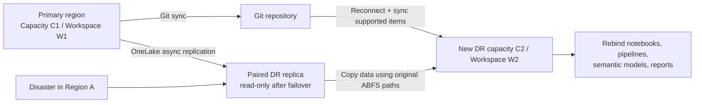
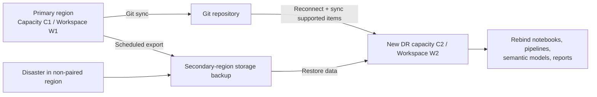

# Architecture

This repo documents two different disaster-recovery patterns for Microsoft Fabric:

1. **Paired-region recovery** using native OneLake DR replication plus `fabric-toolbox`
2. **Non-paired-region recovery** using custom cross-region backups plus `fabric-toolbox`-inspired restore logic

## Paired-region flow

### Key point

After OneLake failover, the original ABFS paths resolve to the **replicated data in the paired region**. The copy step does **not** reach back to the downed primary region.

## Non-paired-region flow

### Key point

There is **no native OneLake DR replica** for non-paired-region recovery. If cross-region backups were not created before the disaster, data restoration is blocked until the primary region becomes available again.

## Layered model

| Layer | Responsibility |
|------|----------------|
| Native Fabric | OneLake DR replication, Git integration, Fabric REST APIs, ARM resource provisioning |
| `fabric-toolbox` | Primary metadata capture, DR notebook orchestration, warehouse recovery helpers, optional lakehouse mirroring helpers |
| This repo | DR capacity Bicep, scenario docs, config schema, non-paired design, validation, end-to-end demo flow |
